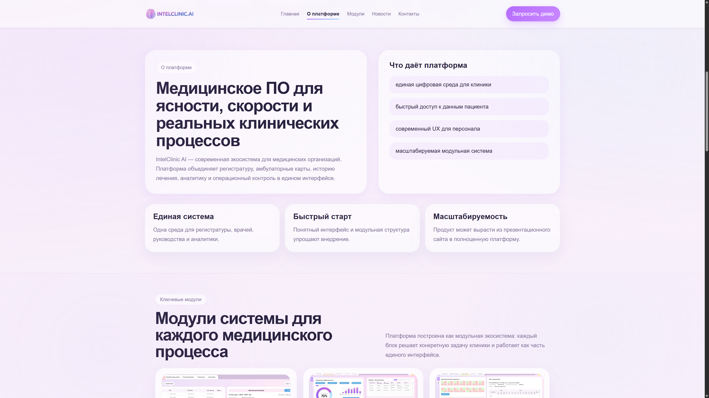
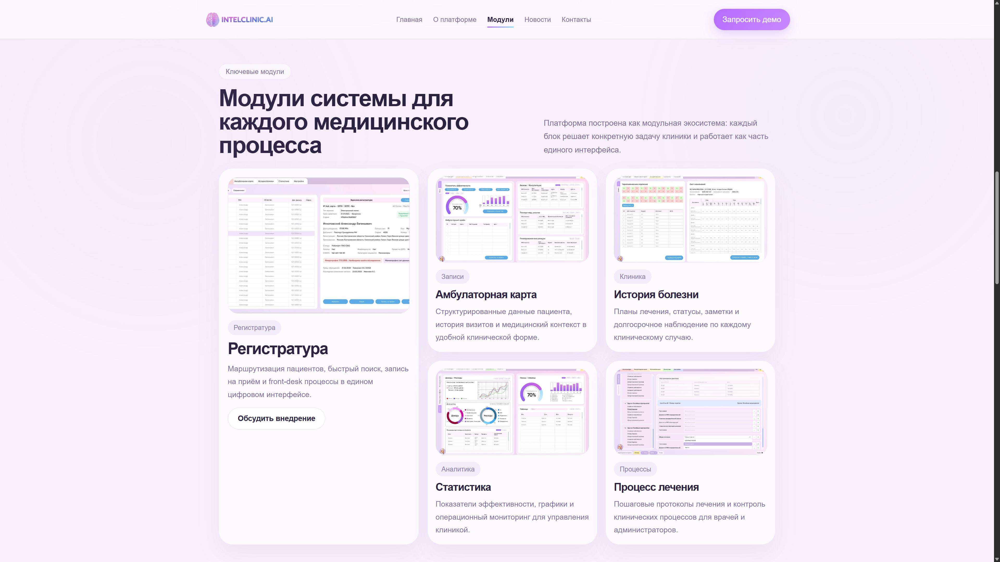
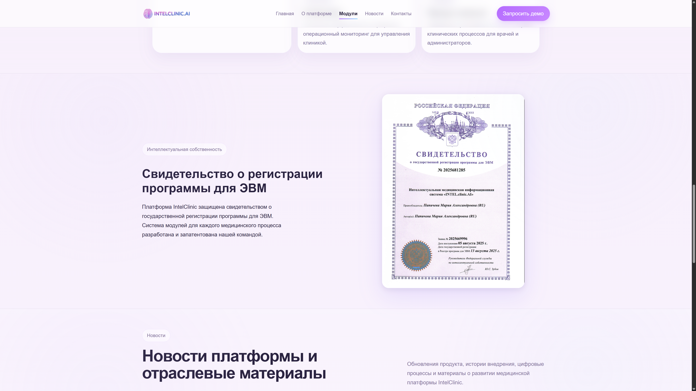
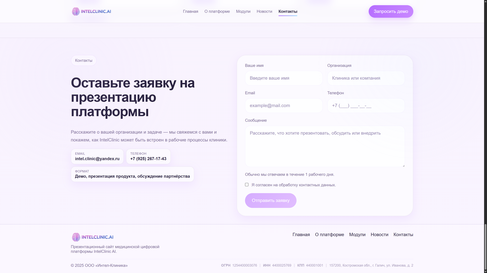

<p align="center">
  
</p>

<h1 align="center">IntelClinic AI — Medical Digital Platform</h1>

<p align="center">
  Presentation website for the IntelClinic AI medical digital platform
</p>

<p align="center">
  <a href="https://intel-clinic.ru"></a>
  
  
  
</p>

---

## Screenshots

| Hero | About | Modules |
|------|-------|---------|
|  |  |  |

| Patent | Contacts |
|--------|----------|
|  |  |

---

## Tech Stack

| Layer | Technologies |
|---|---|
| UI | React 19, TypeScript |
| Build | Vite 8 |
| Styles | SCSS |
| Animations | Framer Motion |
| Forms | React Hook Form + Zod |
| Routing | React Router v7 |

---

## Project Structure

```bash
src/
├── app/        # Root component, global styles
├── pages/      # Landing, blog list, blog post, 404
├── widgets/    # Page sections — header, footer, hero, about, modules, etc.
├── features/   # Contact form, active section tracking
├── entities/   # Blog post types & API calls
└── shared/     # UI components, utilities, config, assets
```

Architecture follows **Feature-Sliced Design (FSD)**.

---

## Features

- Multi-section landing page (hero, about, modules, patent, blog, contacts)
- Demo request / contact form
- Blog with posts fetched from a headless CMS API
- SEO: meta tags, canonical URLs, sitemap.xml, robots.txt
- Scroll-based reveal animations
- Fully responsive layout

---

## What's Not Included

This repository contains only the **public-facing frontend**.

The full platform additionally includes:

- **CMS Admin Panel** — post editor with scheduling, media library, lead inbox, role-based access control (superadmin / editor), activity log, analytics dashboard
- **Backend API** — Node.js + Express REST API, SQLite database, JWT authentication, file uploads

These parts are not published as they contain proprietary business logic and internal infrastructure. The frontend is designed to work against any compatible API.

---

## Getting Started

```bash
npm install
npm run dev
# → http://localhost:5173
```

Configure the API endpoint via environment variable:

```env
VITE_API_BASE_URL=http://localhost:3001/api
```

---

> Русская версия: [README.ru.md](README.ru.md)
